# מדריך התקנה — Weekly Hours Report

מדריך צעד-אחר-צעד למשתתפי הסדנא. אם משהו לא ברור, ראי [troubleshooting.md](troubleshooting.md).

המדריך מחולק לשלושה חלקים:

- **חלק א'** — הקמת Composio Platform: יצירת Auth Configs ל-Google Sheets ול-Gmail וחיבור חשבון Google אמיתי.
- **חלק ב'** — הקמת הסקיל המקומי (להרצה ידנית).
- **חלק ג'** — Cron שבועי דרך GitHub Actions (להרצה אוטומטית).

---

## לפני שמתחילים — מה תצטרכי

המדריך מבקש ממך לאסוף 4 ערכים בדרך. כדאי לפתוח מסמך/Notes ולשמור אותם תוך כדי:

| # | ערך | איפה תקבלי | מתי תשתמשי |
|---|---|---|---|
| 1 | **`COMPOSIO_API_KEY`** | בשלב 14 (Composio → API Keys → Create) | בשלב 20 (env var) + שלב 24 (GitHub Secret) |
| 2 | **`SHEET_ID`** | מה-URL של הטבלה — הקטע בין `/d/` ל-`/edit` | בשלב 21 (`setup.py`) + שלב 24 (GitHub Secret) |
| 3 | **`EMPLOYEE_TABS`** | שמות הטאבים בטבלה, בדיוק כמו שהם (לדוגמה `אופיר, אביב, נועה`) | בשלב 21 (`setup.py`) + שלב 24 (GitHub Secret, כמחרוזת JSON) |
| 4 | **`RECIPIENT_EMAIL`** | את בוחרת — מי שיקבל את הדוח השבועי | בשלב 21 (`setup.py`) + שלב 24 (GitHub Secret) |
| 5 | **`COMPOSIO_USER_ID`** | אופציונלי (גילוי אוטומטי) — ה-User ID שהזנת בשלב 16 בעת חיבור החשבון | מתגלה אוטומטית מהחיבורים שלך, אבל אפשר להגדיר ידנית אם יש כמה חשבונות |

**חשבונות שתצטרכי:**
- ✅ חשבון **Composio** (חינם) — נירשם בשלב 1
- ✅ חשבון **Google** עם גישה לטבלת השעות
- ✅ חשבון **GitHub** (אופציונלי, רק אם תרצי cron שבועי אוטומטי)

**זמן משוער:** 15-20 דקות מההתחלה ועד דוח test שנשלח.

---

## חלק א' — הקמת Composio Platform

### 1. הרשמה ל-composio.dev

היכנסי ל-[composio.dev](https://composio.dev) והרשמי (חינם). אפשר להתחבר עם Google.

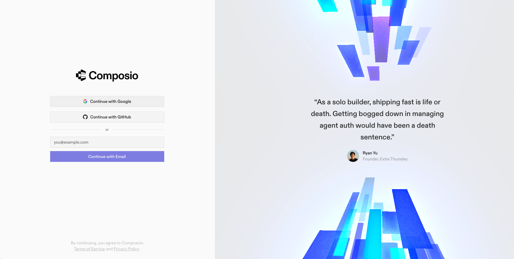

### 2. מסך Getting Started

אחרי ההרשמה תגיעי למסך Getting Started. כאן יוצרים את ה-API key בהמשך, אבל קודם נחבר את ה-Toolkits.

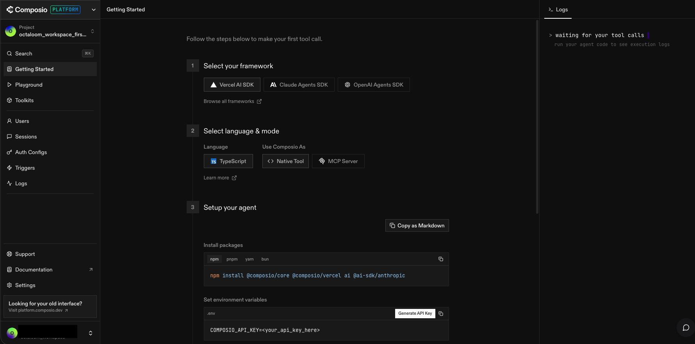

### 3. יצירה או בחירה של Project

ב-Composio כל סביבת עבודה היא Project. אם זה החשבון הראשון שלך כבר יש Project ברירת מחדל — אפשר להישאר בו. אחרת לחצי **+ New Project** ותני שם (למשל `weekly-hours-report`).

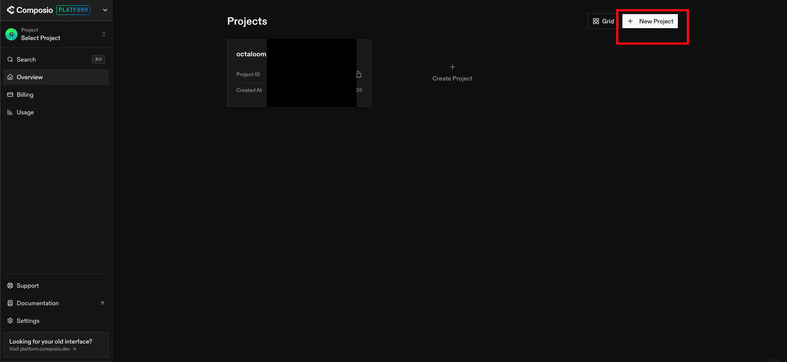

### 4. דפדוף ב-Toolkits

מהסיידבר השמאלי לכי ל-**Toolkits**. נחפש שניים: **Google Sheets** ו-**Gmail**.

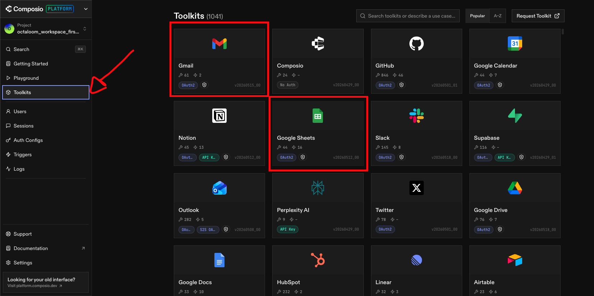

### 5. הוספת Google Sheets ל-Project

לחצי על Google Sheets ואז על **Add to Project** מימין.

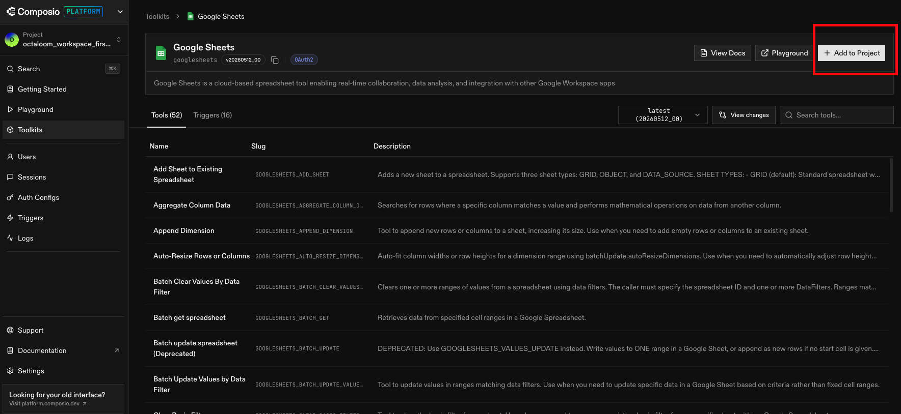

### 6. שם ה-Auth Config

יפתח חלון שמבקש שם. אפשר להשאיר את ברירת המחדל או לשנות (למשל `Google Sheets - Weekly Report`). לחצי **Next**.

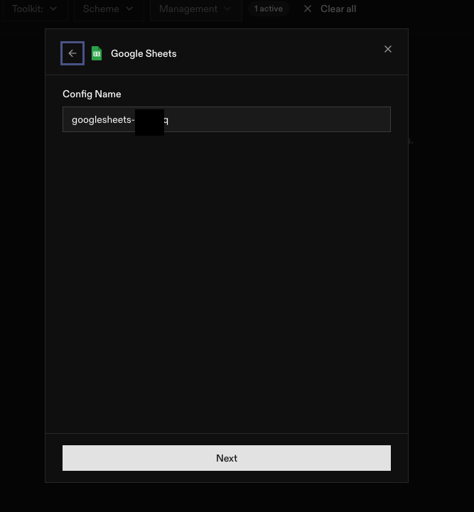

### 7. בחירת Auth Method

- **Auth Method:** OAuth 2.0
- **Auth Mode:** Composio Managed (זה הקל ביותר — Composio מנהלת את ה-OAuth credentials במקומך)
- **Scopes:** סמני את ה-scopes הנדרשים (3 scopes ל-Google Sheets — קריאה, כתיבה, drive metadata)

לחצי **Create Auth Config**.

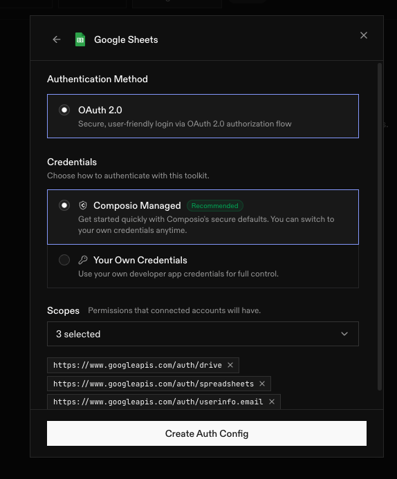

### 8. Auth Config נוצר

חזרי ל-Auth Configs בסיידבר ותראי את הרשומה החדשה של Google Sheets ברשימה.

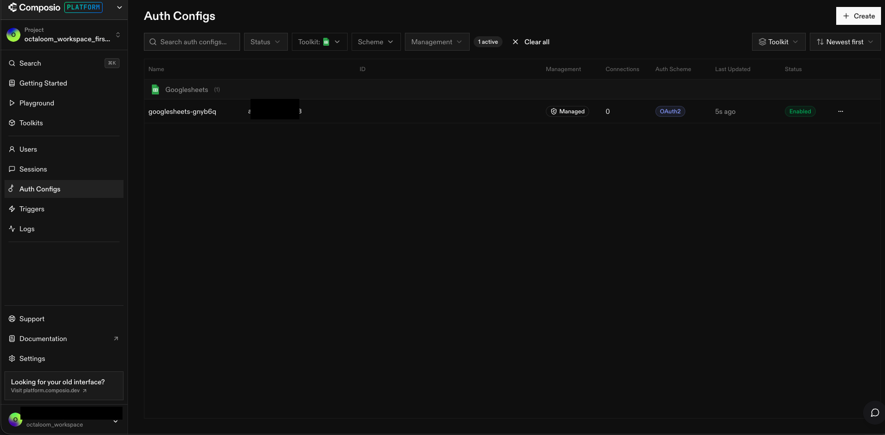

### 9. אותו תהליך עבור Gmail

חזרי ל-Toolkits, חפשי Gmail ולחצי **Add to Project**.

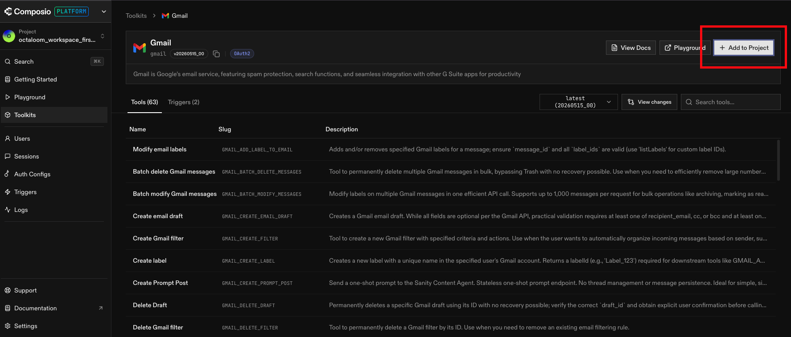

### 10. שם ל-Gmail Auth Config

שוב יבקשו שם. השאירי או שני (למשל `Gmail - Weekly Report`). **Next**.

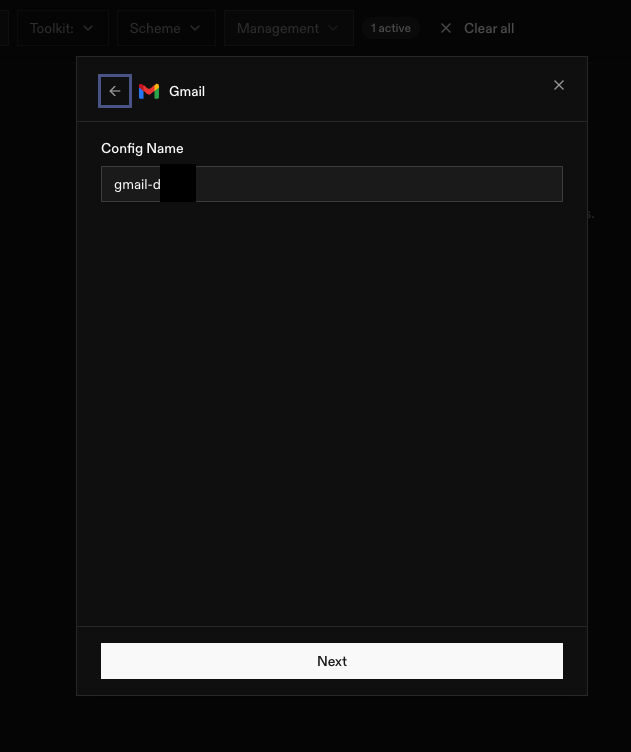

### 11. Auth Method ל-Gmail

- **Auth Method:** OAuth 2.0
- **Auth Mode:** Composio Managed
- **Scopes:** 11 scopes ל-Gmail (לכל הפחות `gmail.send` ו-`gmail.compose`). סמני את כולם — בטוח יותר.

לחצי **Create Auth Config**.

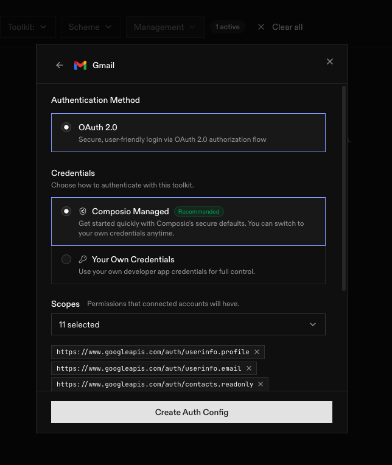

### 12. מציאת ה-API Keys

עכשיו צריך לקבל API key. בסיידבר השמאלי לחצי על **API Keys**.

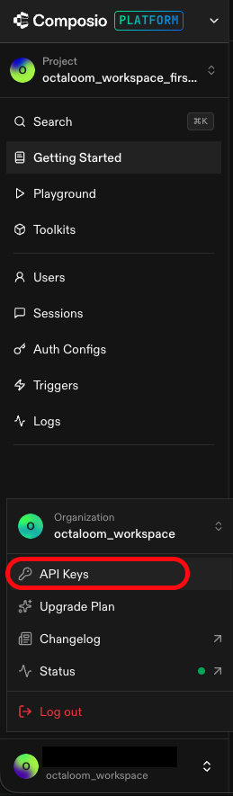

### 13. רשימת ה-API Keys

זה המסך שמציג את כל ה-API keys. אם זו פעם ראשונה תהיה רשימה ריקה. לחצי על הכפתור ליצירת מפתח חדש.

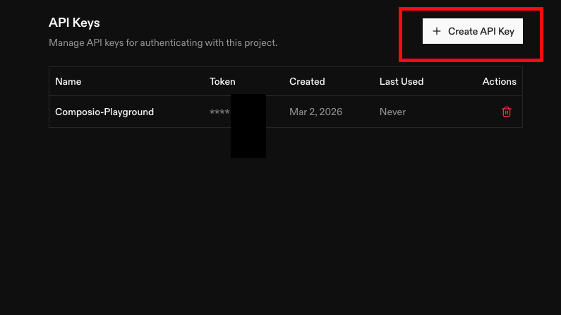

### 14. יצירת API key חדש

תני למפתח שם (למשל `Claude Code - Weekly Report`). לחצי **Create**.

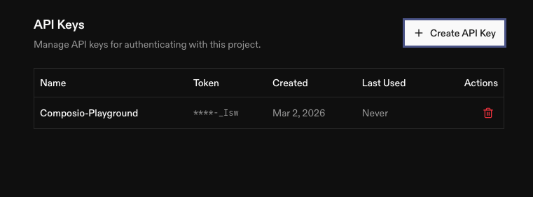

> **חשוב!** המפתח מוצג רק פעם אחת. העתיקי אותו עכשיו לאיזה place-holder בטוח (1Password, Apple Notes וכו'). אחר כך תוכלי לראות רק את 4 התווים האחרונים שלו.

### 15. חיבור חשבון Google ל-Auth Config של Google Sheets

עכשיו צריך לחבר חשבון Google אמיתי לכל אחד מה-Auth Configs. חזרי ל-Auth Configs, לחצי על Google Sheets, ובפאנל הימני שיפתח לחצי **Connect Account**.

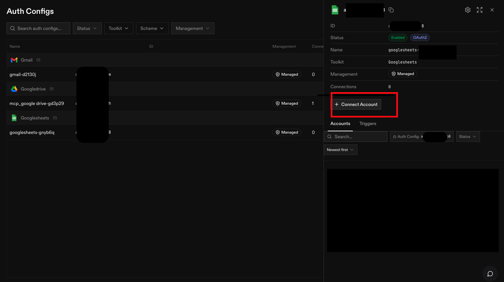

### 16. מתן User ID לחיבור

יפתח חלון שמבקש User ID. זה מזהה פנימי של Composio שמשמש לזהות את ה-connection. אפשר להזין כל מחרוזת — מומלץ משהו פשוט כמו `default` או המייל שלך. לחצי **Connect**.

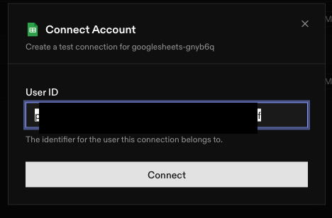

יפתח חלון Google OAuth של אמת — בחרי את החשבון, אשרי הרשאות, ותחזרי ל-Composio.

חזרי על השלב הזה (15 + 16) גם ל-Gmail.

### 17. וידוא — שני החיבורים מחוברים

חזרי ל-Auth Configs. צריך לראות לפחות שתי שורות (Gmail + Google Sheets), בכל אחת `1 connection` ו-`Enabled`.

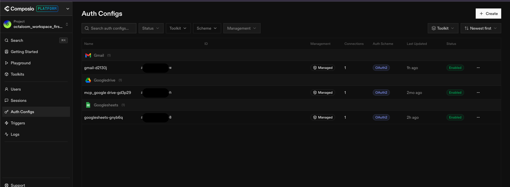

> אם רואים `0 connections` בשורה כלשהי — חזרי לשלב 15.

---

## חלק ב' — התקנת הסקיל המקומי

### 18. הורדת הסקיל

```bash
git clone https://github.com/Hanita-y/weekly-hours-report.git ~/.claude/skills/weekly-hours-report
cd ~/.claude/skills/weekly-hours-report
```

### 19. התקנת תלויות

```bash
python -m venv .venv
source .venv/bin/activate   # ב-Windows: .venv\Scripts\activate
pip install -r requirements.txt
```

### 20. הגדרת ה-API key

```bash
export COMPOSIO_API_KEY="המפתח שהעתקת בשלב 14"
```

(ב-zsh/bash הוסיפי את השורה ל-`~/.zshrc` כדי שתישמר בין sessions).

### 21. הרצת ה-setup

```bash
python scripts/setup.py
```

ה-script יבקש:

- **Google Sheet ID** — מתוך ה-URL של הטבלה. הוא הקטע בין `/d/` ל-`/edit`.
- **שמות טאבים** — בדיוק כמו שהם בטבלה, מופרדים בפסיק (למשל `אופיר, אביב, נועה`).
- **מייל יעד** — מי מקבל את הדוח.
- **CC** — מיילים נוספים שיקבלו עותק (אופציונלי).
- **Cron** — מתי לשלוח. השאירי את ברירת המחדל (`0 8 * * 0`) לראשון 08:00.

ה-script ייצור `config.json` מקומי.

### 22. שליחת דוח test ידני

ה-setup ישאל אם לשלוח דוח test עכשיו. בחרי `y`. תוך 30 שניות אמור להגיע מייל לכתובת שהגדרת.

אפשר תמיד להריץ ידנית:

```bash
python -m scripts.generate_report
```

> 💡 חשוב: הריצי תמיד `python -m scripts.generate_report` (לא `python scripts/generate_report.py`) כדי ש-Python ימצא את החבילה. הריצי תמיד משורש התיקייה של הסקיל.

---

## חלק ג' — Cron שבועי דרך GitHub Actions

הסקיל לא רץ על תשתית של Composio. כדי שהדוח יישלח אוטומטית כל שבוע, מפעילים את ה-workflow ב-GitHub Actions:

### 23. Fork לריפו

לכי ל-[github.com/Hanita-y/weekly-hours-report](https://github.com/Hanita-y/weekly-hours-report), לחצי **Fork** למעלה ימינה, צרי עותק תחת החשבון שלך.

### 24. הוספת Repository Secrets

בריפו ה-fork שלך לכי ל-**Settings → Secrets and variables → Actions → New repository secret**. הוסיפי:

| שם ה-Secret | ערך |
|---|---|
| `COMPOSIO_API_KEY` | המפתח שהעתקת בשלב 14 |
| `SHEET_ID` | ה-Spreadsheet ID של הטבלה |
| `EMPLOYEE_TABS` | מחרוזת JSON, למשל `["אופיר","אביב","נועה"]` |
| `RECIPIENT_EMAIL` | כתובת המייל ליעד |
| `CC_EMAILS` | אופציונלי — מיילים מופרדים בפסיק (אם אין, אל תוסיפי את ה-secret הזה) |
| `COMPOSIO_USER_ID` | אופציונלי — אם לא תוסיפי, יתגלה אוטומטית מה-Connected Accounts שלך |

### 25. הפעלה ראשונה / בדיקה

הקרון מוגדר ל-`0 5 * * 0` ב-UTC = ראשון 08:00 שעון ישראל. כדי לבדוק שהכל עובד בלי לחכות לראשון:

- ב-GitHub לכי ל-**Actions → weekly-report → Run workflow**. זה יריץ את ה-workflow ידנית באותו רגע.
- בדקי את הלוג — צריך לראות `Sent message id=...` בסוף.
- המייל ייפול לתיבת הדואר תוך כמה שניות.

### 26. סיום

מעכשיו הדוח יישלח אוטומטית ראשון 08:00 שעון ישראל. אין צורך לעשות כלום.

---

## להעביר את הסקיל למישהו אחר

כל משתתפת בסדנא צריכה:

1. חשבון Composio משלה (חלק א')
2. גישה משלה לטבלה (או טבלה משלה)
3. Fork משלה לריפו + Repository Secrets משלה (חלק ג')

ה-`config.json` הוא אישי ולא נכנס ל-Git, אז אין סכנת דליפת סודות בריפו הציבורי.
